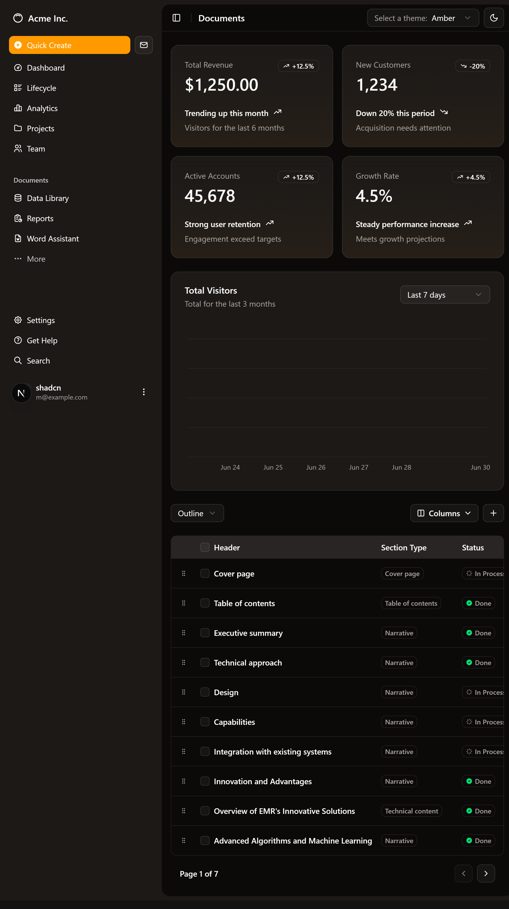

# Modern UI Dashboard

A sleek, responsive admin dashboard UI built with **Shadcn**, **Tailwind CSS**, and **Next.js**. This template is ideal for building modern internal tools, admin panels, or data-driven interfaces.

---

## 📸 Screenshot

 

---

## 🧰 Tech Stack

- React + Next.js 13 (App Router)
- TypeScript
- Tailwind CSS
- Shadcn UI
- Radix UI

---

## 🛠 Getting Started

Follow the steps below to run this project locally on your machine:

**Step 1 – Clone the Repository**

```bash
git clone https://github.com/alaerejones/Modern_UI_Dashboard.git
```

**Step 2 – Navigate into the folder you cloned into**

```bash
cd Modern_UI_Dashboard
```

**Step 3 – Install Dependencies**

Make sure you have `pnpm` installed. then run:

```bash
pnpm install
```

If you prefer another package manager, you can also use:

```bash
npm install
# or
yarn install
# or
bun install
```

**Step 4 – Start the Development Server**

```bash
pnpm dev
```

**Step 5 – Open in Browser**

Visit `http://localhost:3000/dashboard` in your browser to view the dashboard.
